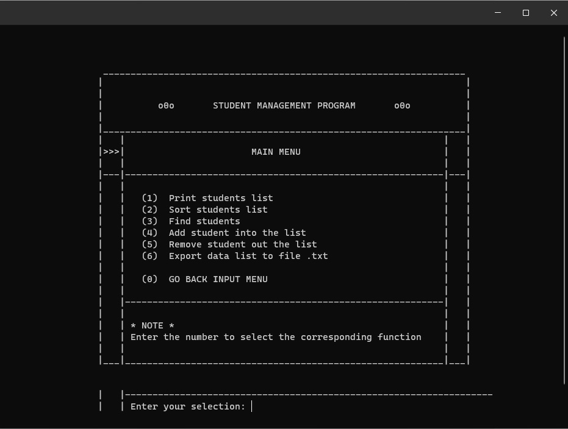
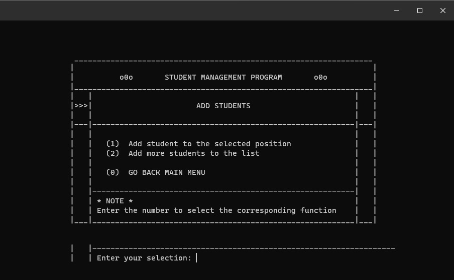
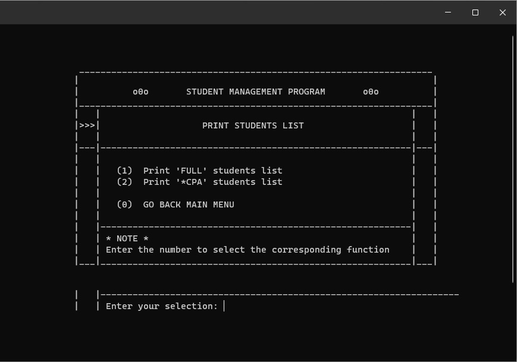

# 🎓 Student Management System in C++

A comprehensive, console-based application for managing student records, built entirely in **C++**.  
This project demonstrates core software engineering principles including data structures, file I/O, modular design, and a menu-driven user interface.

---

## 🎥 Project Demo

Below is a brief video demonstration of the program's core features, including adding, viewing, searching, and deleting student records.

[▶️ Watch the Demo Video](https://drive.google.com/file/d/1qIWMHPcw6YJywCfkJydApHWwcPrs68rG/view?usp=sharing)

---

## ✨ Core Features

- **Add New Students:** Dynamically add new student records to the system.  
- **View All Students:** Display a formatted list of all students currently in the system.  
- **Search Functionality:**  
  - Find students by their unique Student ID.  
  - Find students by their First or Last Name.  
- **Update Records:** Modify the details of an existing student.  
- **Delete Students:** Remove a student record from the system.  
- **Data Persistence:** Save the entire student list to a `.txt` file and load it back into the program, ensuring no data is lost between sessions.  
- **CPA Calculation:** Calculate and display students with a Cumulative Point Average (CPA) above a certain threshold.

---

## ⚙️ Technical Details

### 🧩 Data Structure: Singly Linked List
The backbone of this project is a **singly linked list**, chosen for its dynamic nature — allowing the system to handle any number of students without a predefined limit.

Each student is stored in a `stud` node:
- Each node contains the student's data and a `pNext` pointer to the next student.
- The entire list is managed by a `Class` structure that holds a `pHead` pointer to the first node.

This makes operations like adding and deleting students efficient in terms of memory management.

---

### 🧱 Modular Design

The code is organized into a clean, modular structure for maintainability and clarity:

| File | Description |
|------|--------------|
| `Student.h` | Defines the core data structures (`stud`, `dOB`, `grade`). |
| `Class.h` | Defines the `Class` structure containing the linked list. |
| `function.h` / `function.cpp` | Contains declarations and implementations for all data manipulation functions (`addStudent`, `deleteStudent`, etc.). |
| `Student_Management_Program.cpp` | Serves as the main driver, handling user input and menu navigation. |

---

### 📊 CPA Calculation Logic

The program calculates the **Cumulative Point Average (CPA)** on a **10-point scale** based on a weighted average of the student's grades.

#### Subject Credits:
| Subject | Credits |
|----------|----------|
| Math | 4 |
| Physics | 4 |
| Chemistry | 2 |
| Literature | 3 |
| English | 3 |
| **Total** | **16** |

#### Formula:
\[
CPA = \frac{(Math \times 4) + (Physics \times 4) + (Chemistry \times 2) + (Literature \times 3) + (English \times 3)}{16}
\]

**Example:**
If a student scores  
Math = 9, Physics = 8, Chemistry = 7, Literature = 9, English = 8  

Then:
\[
CPA = \frac{(9×4) + (8×4) + (7×2) + (9×3) + (8×3)}{16} = 8.31 / 10.0
\]

---

## 🚀 How to Compile and Run

The project is written in **standard C++** and can be compiled using `g++`.

### 1️⃣ Clone the Repository:
```bash
git clone https://github.com/smeetpatel2530/Student-Management-System-CPP.git
```
### 2️⃣ Navigate to the Project Directory:
```bash
cd Student-Management-System-CPP/Student_Management_Program
```
### 3️⃣ Compile the Source Files:
```bash
g++ Student_Management_Program.cpp Student.cpp Class.cpp function.cpp -o student_management
```
### 4️⃣ Run the Application:
Windows:
```bash
.\student_management.exe
```
macOS/Linux:
```bash
./student_management
```
### 📸 Screenshots




### 📜 License

This project is licensed under the MIT License – see the LICENSE.txt file for details.
